This page keeps the code-oriented material outside the frozen manuscript. The
examples use the public package interface and mirror the workflows used for the
figures and tables in the SAGUI paper.

## Common setup

```r
suppressPackageStartupMessages({
  library(sagui)
  library(FITSio)
  library(ggplot2)
})

sagui_palette <- c("#213E60", "#94B6EF", "#F4F2EF", "#E68C3A")
```

The examples assume a FITS cube with dimensions `[x, y, band]`. If your cube is
already an array, pass the array directly to `segment_regions()`.

```r
cube <- FITSio::readFITS("data/my_psfmatched_cube.fits")
bands <- FITSio::axVec(3, cube$axDat)
```

## Data products

The package outputs image-plane products and tables. The core visual outputs are
a white image, a support mask, a segmentation map, and optional painted
physical-property maps after SED fitting.

::: {.gallery-grid}
::: {.output-card}
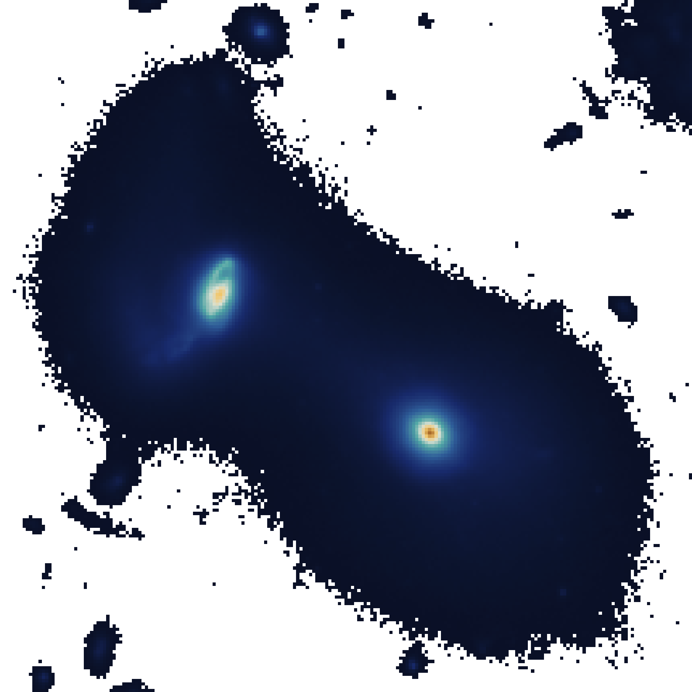

**White image**
:::

::: {.output-card}
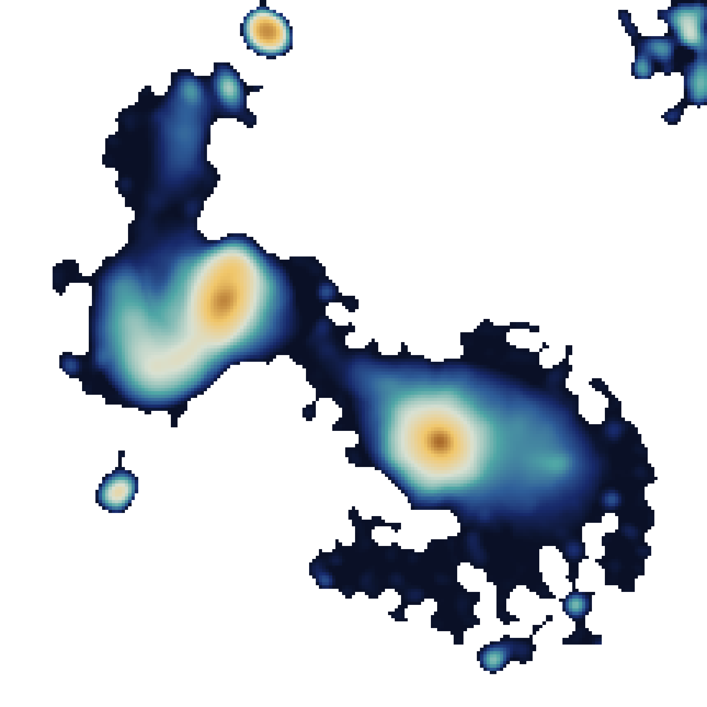

**Starlet support**
:::

::: {.output-card}
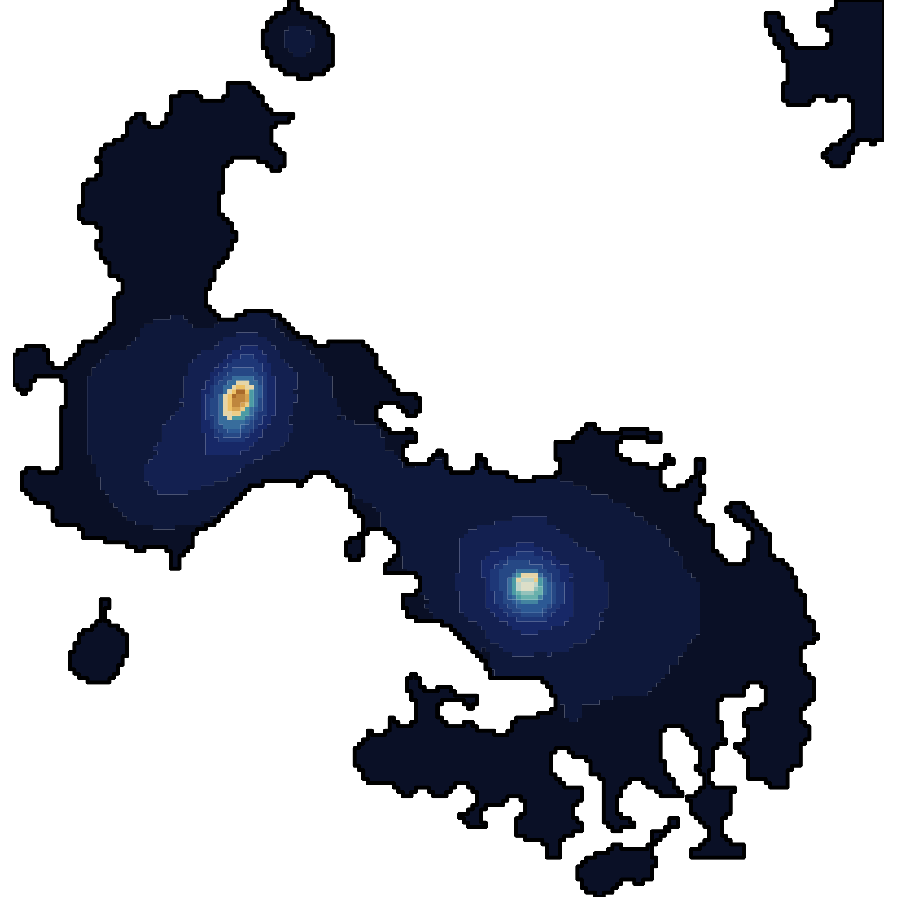

**Segmentation**
:::
:::

## First segmentation

Use this when the number of valid pixels is small enough for a full pairwise
distance matrix.

```r
seg <- segment_regions(
  input = cube,
  Ncomp = 20,
  use_starlet_mask = TRUE,
  starlet_J = 5,
  starlet_scales = 2:5,
  include_coarse = FALSE,
  denoise_k = 2.5,
  cluster_pretransform = "none",
  hclust_method = "ward.D2"
)

plot_region_map(
  seg,
  palette = sagui_palette,
  border_color = "black",
  background_color = "white"
)
```

::: {.image-card .medium-image}

:::

## Sagui-10 example

Sagui-10 is one of the main examples in the manuscript. The run below uses the
same 20-region setup used for the segmentation comparison and for the regional
SED tables.

::: {.gallery-grid}
::: {.output-card}
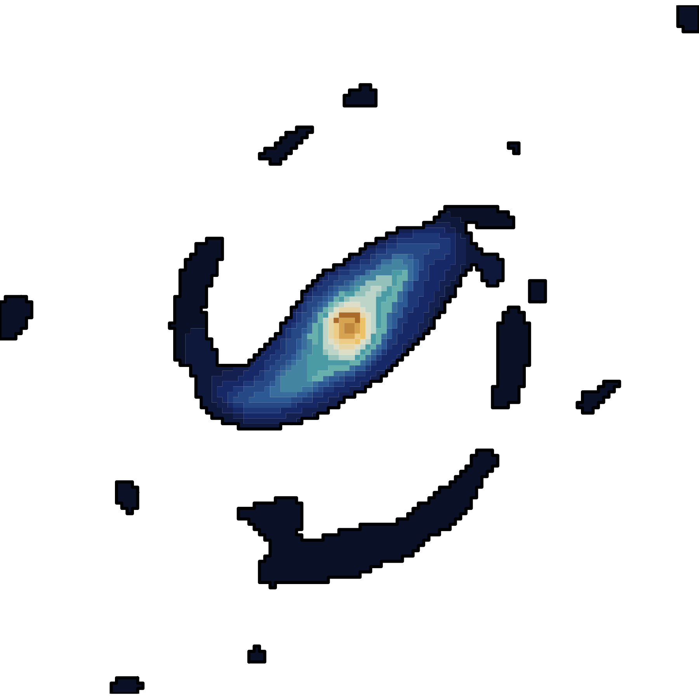

**SAGUI**
:::

::: {.output-card}
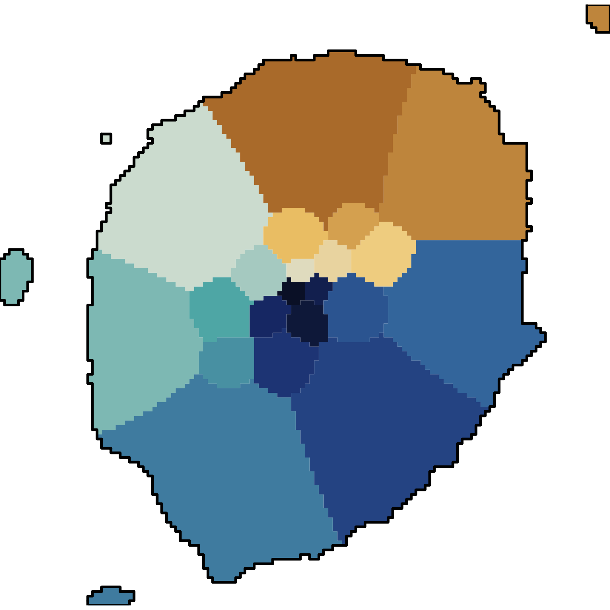

**Voronoi comparison**
:::

::: {.output-card}
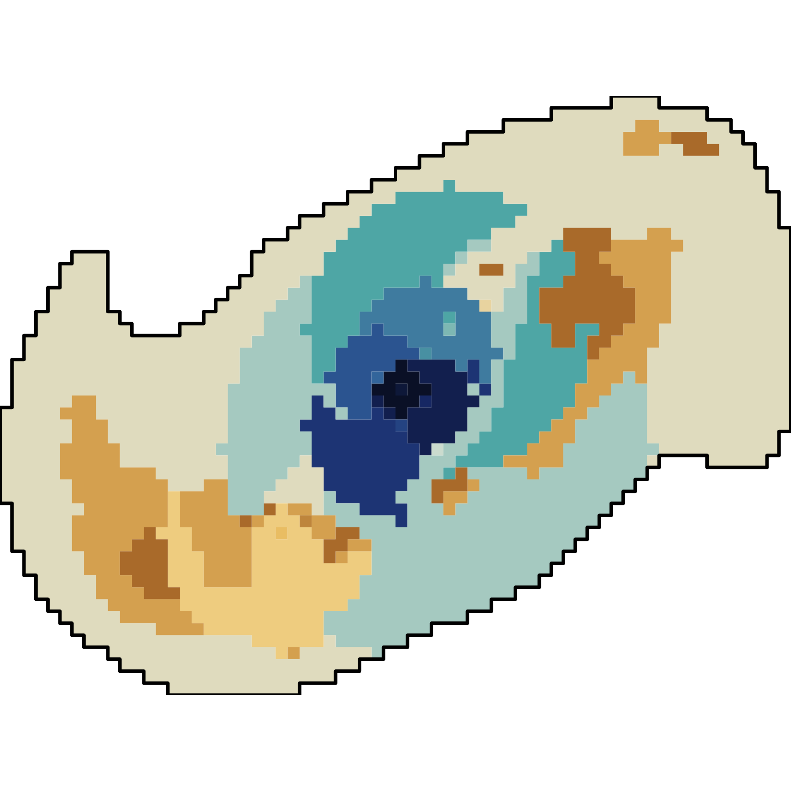

**Pixedfit-style comparison**
:::
:::

```r
jwst <- FITSio::readFITS("data/datacube_sagui10_psfmatched.fits")
jwst_bands <- FITSio::axVec(3, jwst$axDat)

seg20 <- segment_regions(
  input = jwst,
  Ncomp = 20,
  use_starlet_mask = TRUE,
  starlet_J = 5,
  starlet_scales = 2:5,
  include_coarse = FALSE,
  denoise_k = 2.5,
  cluster_pretransform = "none",
  mask_pretransform = "none",
  clean_mask = TRUE,
  min_mask_area = 20
)

sed20 <- extract_region_sed(
  cube = jwst,
  labels = seg20$cluster_map,
  band_values = jwst_bands,
  error_fallback = "mad_sky"
)

utils::write.csv(
  sed20$flux_long,
  "sagui10_n20_region_seds_long.csv",
  row.names = FALSE
)

utils::write.csv(
  sed20$flux_wide,
  "sagui10_n20_region_seds_wide.csv",
  row.names = FALSE
)
```

The long table is convenient for plotting and model fitting. The wide table is
convenient for handing region fluxes to an external SED-fitting pipeline.

The same segmentation can be painted with properties from downstream SED
fitting:

::: {.gallery-grid}
::: {.output-card}
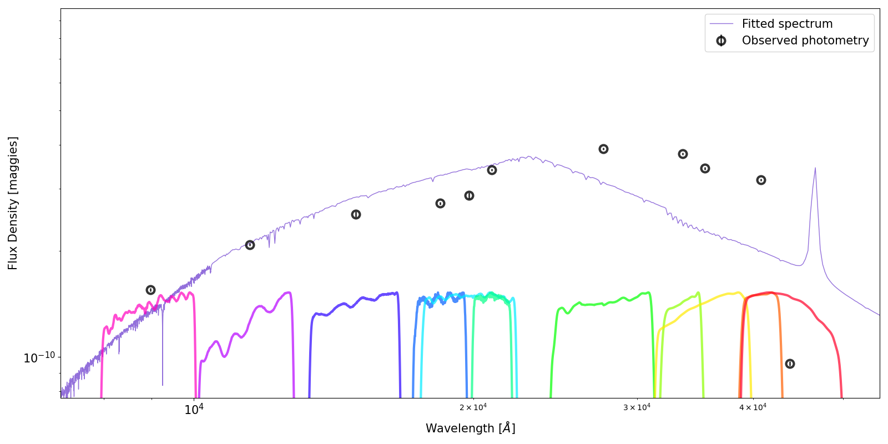

**SED fit**
:::

::: {.output-card}
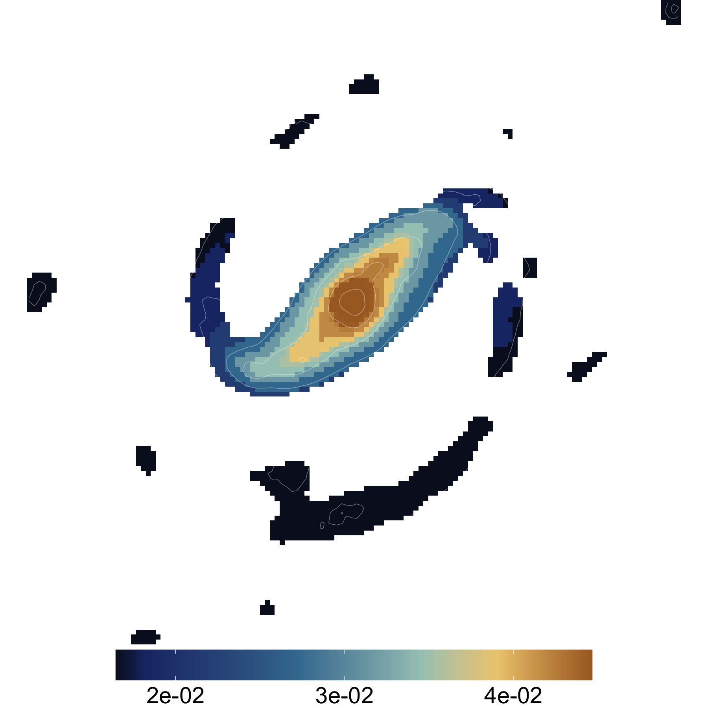

**Painted property map**
:::
:::

## Flux-preserving regional SEDs

The `flux` column is a sum over all pixels in the region:

\[
F_{\nu,k} = \sum_{(x,y)\in R_k} F_\nu(x,y).
\]

The sum is the flux-conserving quantity. The mean SED is useful for diagnostics,
but should not replace the summed SED for photometric fitting.

```r
mean_sed <- transform(
  sed20$flux_long,
  mean_flux = flux / pmax(n_pix, 1)
)
```

If the FITS cube is stored in `10 nJy` units, convert to Jy after extraction:

```r
sed20$flux_long$flux_jy <- sed20$flux_long$flux * 1e-8
sed20$flux_long$flux_err_jy <- sed20$flux_long$flux_err * 1e-8
```

## Sagui-11 faint merger bridge

Sagui-11 is the merger example used in the low-surface-brightness section. The
bridge is faint, so this is the useful place to compare the ordinary run with a
copula-transformed run.

::: {.image-card .wide-image}
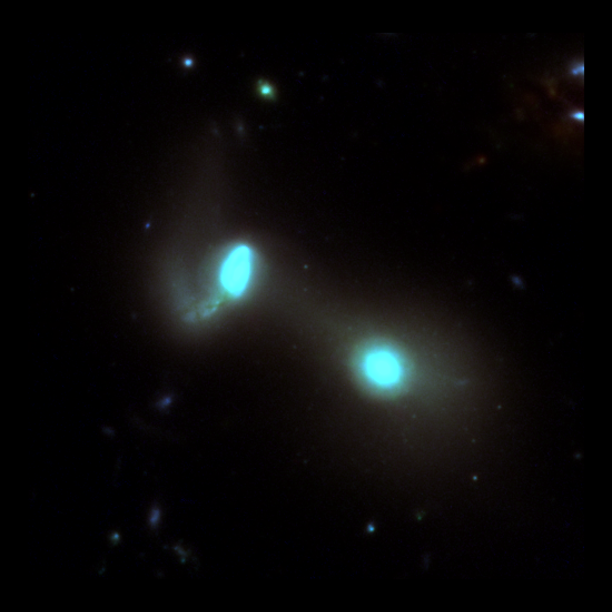
:::

::: {.gallery-grid}
::: {.output-card}


**Input collapse**
:::

::: {.output-card}


**Support**
:::

::: {.output-card}


**Copula segmentation**
:::
:::

```r
lsb <- FITSio::readFITS("data/datacube_sagui11_psfmatched.fits")
lsb_bands <- FITSio::axVec(3, lsb$axDat)

seg_plain <- segment_regions(
  input = lsb,
  Ncomp = 20,
  use_starlet_mask = TRUE,
  starlet_J = 5,
  starlet_scales = 2:5,
  cluster_pretransform = "none"
)

seg_copula <- segment_regions(
  input = lsb,
  Ncomp = 20,
  use_starlet_mask = TRUE,
  starlet_J = 5,
  starlet_scales = 2:5,
  cluster_pretransform = "copula_gaussian"
)
```

For large images, use the sparse backend:

```r
seg_copula_large <- segment_regions_large(
  input = lsb,
  Ncomp = 20,
  use_starlet_mask = TRUE,
  starlet_J = 5,
  starlet_scales = 2:5,
  cluster_pretransform = "copula_gaussian",
  knn_k = 100,
  spatial_weight = 0.02
)
```

## Sparse run

Use this when the exact distance matrix becomes too large. The products are the
same: support mask, segmentation map, and regional SED tables.

::: {.image-card .wide-image}
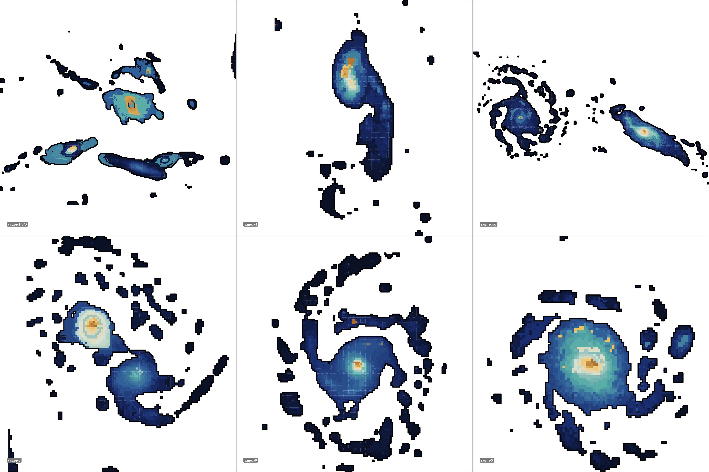
:::

```r
large_seg <- segment_regions_large(
  input = cube,
  Ncomp = 50,
  use_starlet_mask = TRUE,
  starlet_J = 5,
  starlet_scales = 2:5,
  include_coarse = FALSE,
  denoise_k = 0,
  cluster_pretransform = "copula_gaussian",
  mask_pretransform = "none",
  knn_k = 100,
  auto_k = TRUE,
  spatial_weight = 0.02,
  feature_scale = "none"
)

large_sed <- extract_region_sed(
  cube = cube,
  labels = large_seg$cluster_map,
  band_values = bands,
  error_fallback = "mad_sky"
)
```

## Target S/N selection

Use `choose_ncomp_by_snr()` when you want SAGUI to choose the number of
regions from a requested minimum regional S/N. The function returns a normal
segmentation object, but the selected `Ncomp` is the finest value that still
passes the S/N criterion.

The visual result is still a normal segmentation map; the S/N criterion only
chooses how fine the map should be.

`segment_regions()` and `segment_regions_large()` already return a quick
collapsed-image diagnostic, `cluster_snr`. The example below uses the regional
SED table instead, because that is the quantity normally passed to the SED
fitting stage.

::: {.image-card .wide-image}
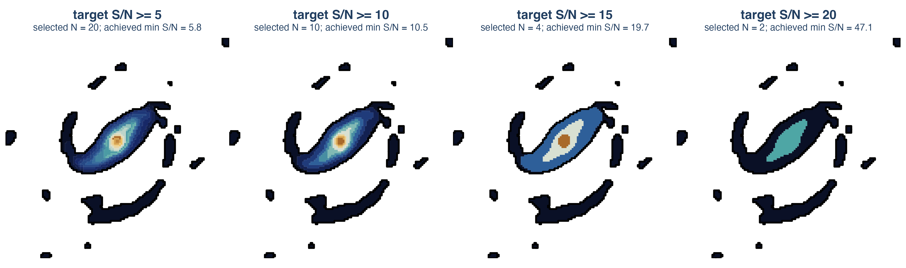
:::

```r
seg_snr <- choose_ncomp_by_snr(
  input = cube,
  min_snr = 10,
  band_values = bands,
  backend = "sparse",
  use_starlet_mask = TRUE,
  starlet_J = 5,
  starlet_scales = 2:5,
  cluster_pretransform = "copula_gaussian",
  knn_k = 100,
  auto_k = TRUE,
  spatial_weight = 0.02
)

seg_snr$Ncomp
seg_snr$snr_grid
```

By default the helper tries a small set of candidate region counts. If you want
to restrict the search to the values used in the paper, pass them explicitly:

```r
seg_snr <- choose_ncomp_by_snr(
  input = cube,
  min_snr = 10,
  k_values = c(10, 15, 20, 30, 40, 60),
  band_values = bands,
  backend = "sparse",
  use_starlet_mask = TRUE,
  starlet_J = 5,
  starlet_scales = 2:5,
  cluster_pretransform = "copula_gaussian",
  knn_k = 100,
  auto_k = TRUE,
  spatial_weight = 0.02
)
```

This is a practical way to tune the region count without hand-picking `Ncomp`:
higher `Ncomp` gives finer spatial structure, but lower regional S/N.

If you only need a fast diagnostic, use the S/N values stored in the
segmentation object:

```r
seg_fast <- segment_regions_large(
  input = cube,
  Ncomp = 20,
  use_starlet_mask = TRUE,
  starlet_J = 5,
  starlet_scales = 2:5,
  cluster_pretransform = "copula_gaussian",
  knn_k = 100,
  auto_k = TRUE,
  spatial_weight = 0.02
)

stats::median(seg_fast$cluster_snr, na.rm = TRUE)
```

## Export products

The manuscript-style products are a segmentation map, long and wide region SED
tables, and optional diagnostic images. For a Python workflow, see the dedicated
[Python handoff](python.html) page.

::: {.gallery-grid}
::: {.output-card}
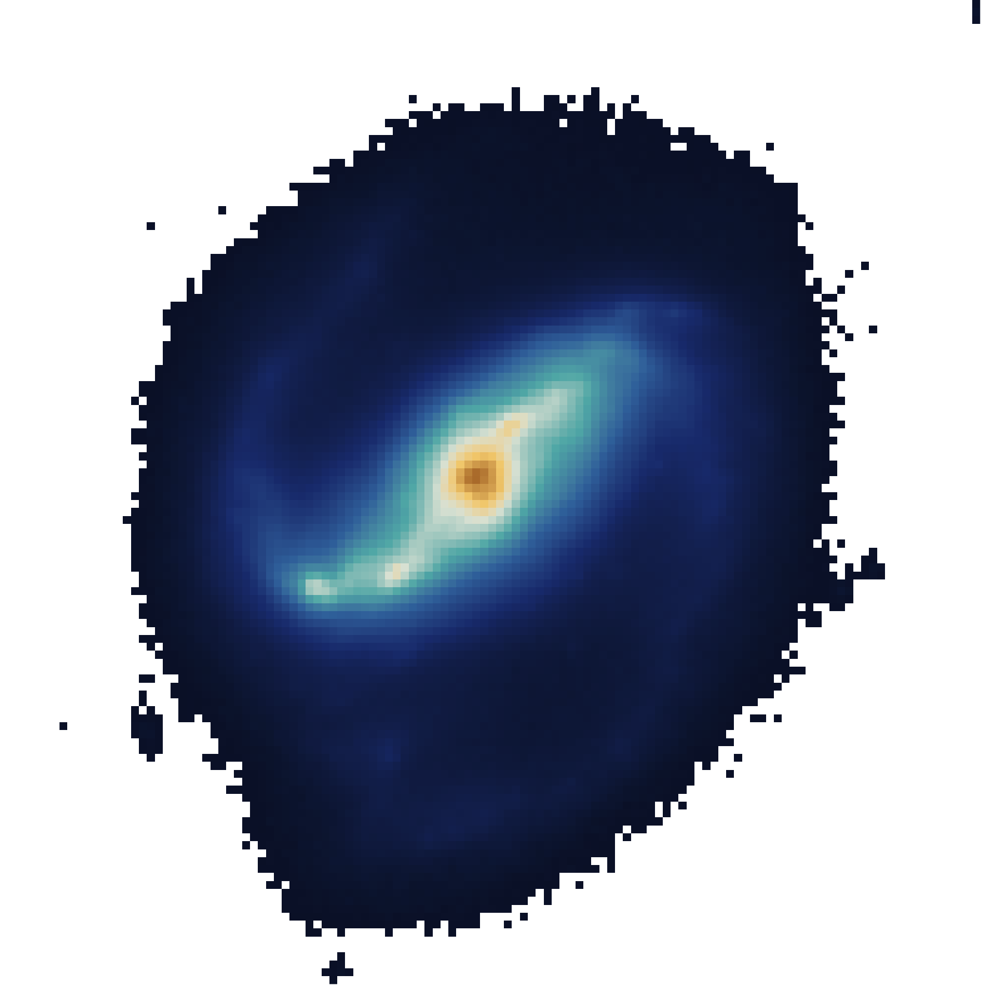

**White image**
:::

::: {.output-card}
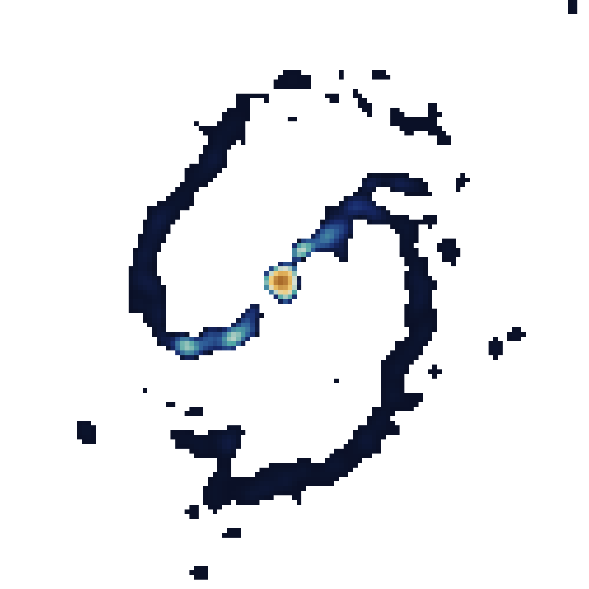

**Starlet scale 2**
:::

::: {.output-card}
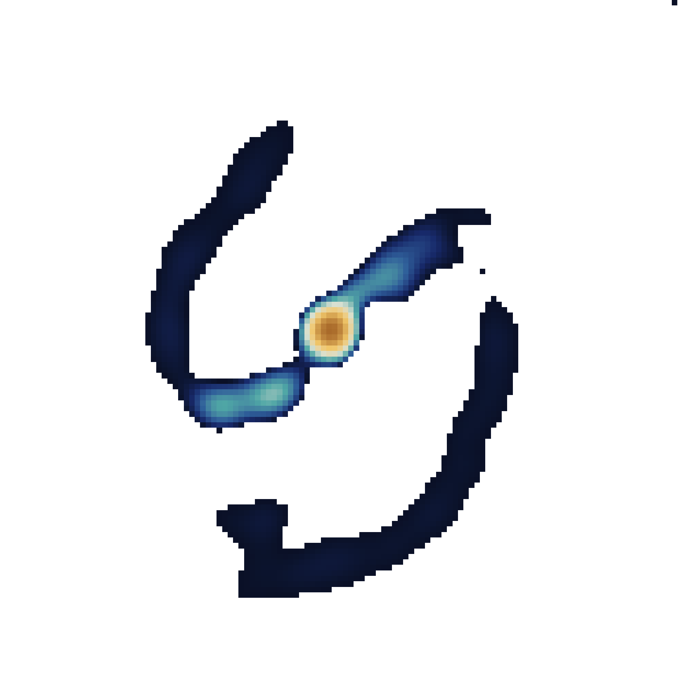

**Starlet scale 3**
:::
:::

```r
dir.create("outputs", showWarnings = FALSE)

utils::write.csv(
  sed20$flux_long,
  file.path("outputs", "region_seds_long.csv"),
  row.names = FALSE
)

utils::write.csv(
  sed20$flux_wide,
  file.path("outputs", "region_seds_wide.csv"),
  row.names = FALSE
)

png(file.path("outputs", "segmentation.png"), width = 1800, height = 1800, res = 220)
print(plot_region_map(seg20, palette = sagui_palette, background_color = "white"))
dev.off()
```

Save the label map as FITS, using `0` outside the SAGUI support:

```r
label_map <- seg20$cluster_map
label_map_out <- label_map
label_map_out[is.na(label_map_out)] <- 0L
storage.mode(label_map_out) <- "integer"

fits_file <- file.path("outputs", "segmentation_map.fits")
if (file.exists(fits_file)) file.remove(fits_file)
FITSio::writeFITSim(label_map_out, file = fits_file, type = "integer")
```

Save a pixel-to-region CSV as a plain, language-independent fallback:

```r
region_pixels <- expand.grid(
  x = seq_len(nrow(label_map)),
  y = seq_len(ncol(label_map))
)
region_pixels$region <- as.vector(label_map)
region_pixels <- subset(region_pixels, !is.na(region))

utils::write.csv(
  region_pixels,
  file.path("outputs", "region_pixels.csv"),
  row.names = FALSE
)
```
